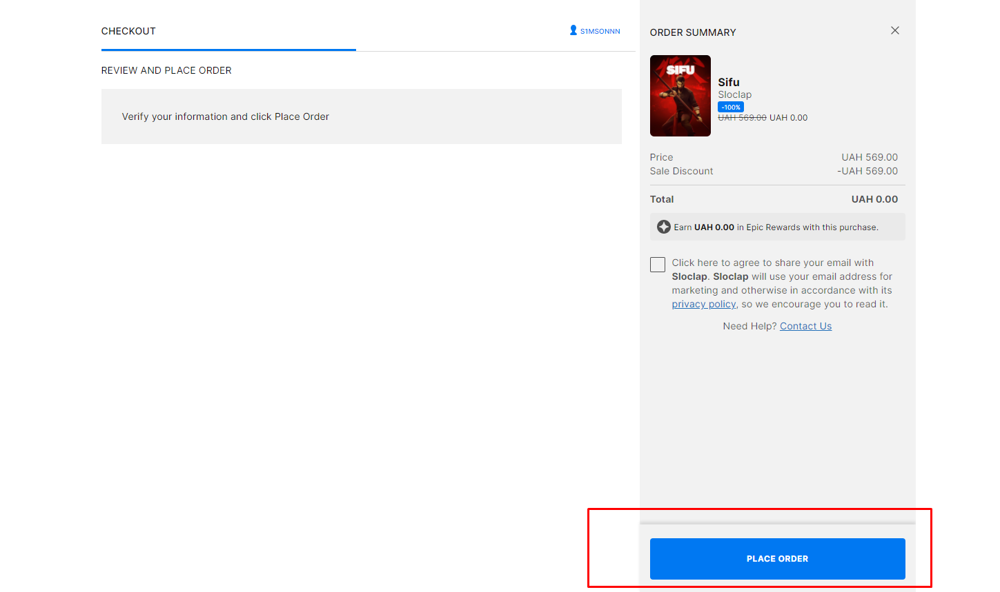

# Epic Awesome Gamer

**Epic Awesome Gamer** is a Python library that automates the process of claiming free games from the Epic Games Store using `playwright` and captcha-solving solutions. This project allows seamless integration of game claiming and order management.

## 🚀 Project Structure

- **`src/epic_awesome_gamer/collector.py`**  
  Contains the `EpicAgent` class responsible for handling interactions with the Epic Games Store, solving captchas, and automating the claiming process.

- **`src/epic_awesome_gamer/epic_games.py`**  
  Manages the core logic for working with Epic Games, including fetching free games via URLs and configuring agents for automation.

- **`src/epic_awesome_gamer/types.py`**  
  Defines essential data models such as `OrderItem`, `OrderPromotion`, and `Order`, which structure the order and promotion data.

## 📸 Screenshots

Here are some visual examples of the functionality:

### 1. **Free Games Claiming Interface**  
     
   Example of the interface where users can claim free games from the Epic Games Store.

### 2. **hCaptcha Solving Example**  
     
   A demonstration of solving captchas with `hcaptcha_challenger`.

### 3. **Order Model Structure**  
     
   Visualizing how the order and promotional data is structured.

## 🛠 Installation

To get started with the project, you need to install the required dependencies. You can do this by running:

```bash
pip install -r requirements.txt
```

## 📝 Usage

### 1. **Setting Up the EpicAgent**:

The `EpicAgent` class is designed for interacting with the Epic Games Store. Here’s how to set it up:

```python
from epic_awesome_gamer.collector import EpicAgent
from playwright.async_api import Page

# Initialize the agent
agent = EpicAgent(page: Page, epic_settings: EpicSettings | None = None, solver_config: AgentConfig)
```

### 2. **Claim Free Games**:

This library simplifies the process of automatically claiming free games on the Epic Games Store. It handles promotions and other necessary data via models defined in `types.py`.

### 3. **Handling Orders**:

The `types.py` file contains data models like `Order`, `OrderItem`, and others that help you structure and manage the order data.

#### Example Usage:

```python
from epic_awesome_gamer.epic_games import URL_CLAIM
from epic_awesome_gamer.types import Order

# Example of creating and processing an order
order = Order(orderType="free_game", orderId="12345", items=[...], promotions=[...])
```

## 📦 Dependencies

This project requires the following Python libraries:

- **`playwright`** — For browser automation.
- **`hcaptcha_challenger`** — For solving captchas.
- **`loguru`** — For logging purposes.
- **`pydantic`** — For data validation.
- **`tenacity`** — For retrying operations.

## I bring the main idea project from guy @QIN2DIM. I do code more readly and improve in some aspects.
**
